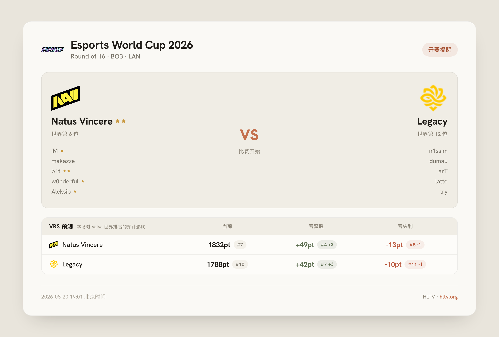
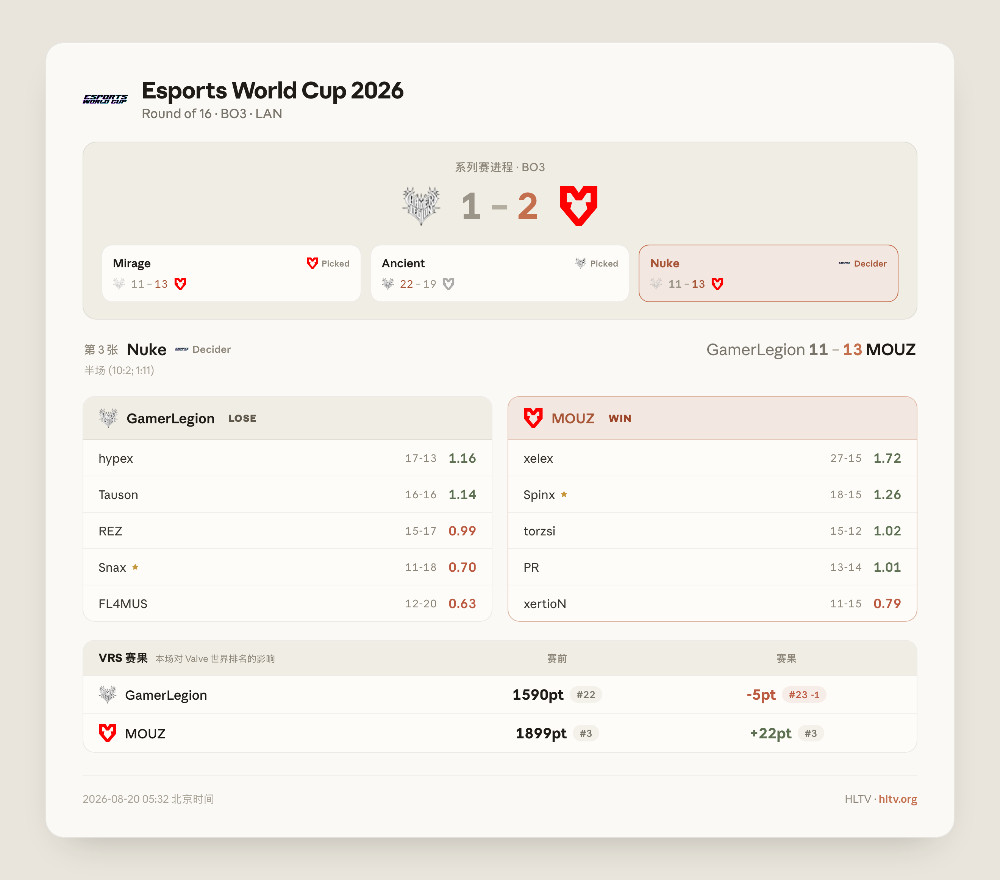
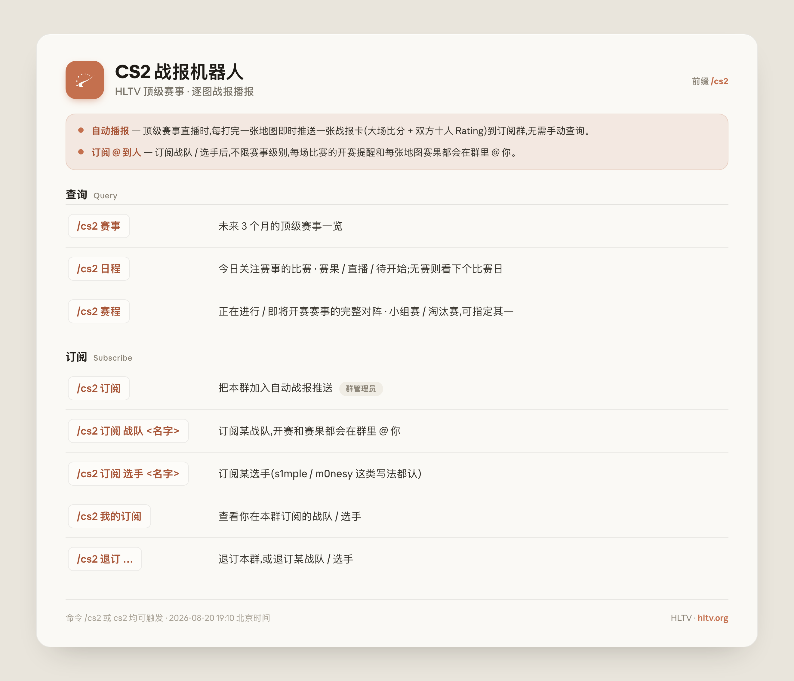

# QQBot · CS2 战报机器人

把 **HLTV 的 CS2 顶级赛事**搬进 QQ 群:直播时每打完一张地图,立刻推送一张精排版战报卡(系列赛进程 + 双方十人 Rating + Valve 排名变化);还支持赛程/赛事查询、战队/选手订阅 @ 到人。

基于 [NoneBot2](https://nonebot.dev/) + [NapCat](https://napneko.github.io/)(OneBot v11),在 macOS (Apple Silicon) 上开发运行,核心插件 `cs2_results` 与平台无关。

## 效果

| 开赛提醒 | 逐图战报 |
|:---:|:---:|
|  |  |

<details>
<summary>帮助卡(命令一览)</summary>



</details>

## 功能

- **自动播报** — 后台轮询 HLTV,顶级赛事(白名单自动维护,可手动增删)直播时逐图推送战报卡到订阅群;进程重启/离线期间漏掉的赛果会补报。
- **开赛提醒** — 订阅的比赛开打时推送开赛卡:双方首发阵容、Major 冠军金星标、VRS 排名预测(赢/输各涨跌多少名)。
- **查询命令** — `/cs2 赛事`(未来 3 个月顶级赛事)、`/cs2 日程`(今日比赛日:赛果/直播/待开始)、`/cs2 赛程 [赛事名]`(完整对阵:瑞士轮/淘汰赛/小组赛)。
- **战队/选手订阅** — `/cs2 订阅 战队 <名字>` / `/cs2 订阅 选手 <名字>`,个人级订阅,开赛和每张地图赛果都在群里 @ 你;选手改名/转会靠本地名录自动跟进。
- **Valve 世界排名(VRS)** — 卡片上队名旁标注 `#N` 世界排名,战报卡附本场对排名的实际影响,数据每日快照 + 比赛页顺路更新,零额外请求。
- **工程化细节** — 抓取限速 + Cloudflare 挑战自动重试;页面/图标多级缓存 + stale-while-revalidate;投递失败指数退避重试、群禁言静默顺延;渲染结果去重。

## 快速开始

需要:Docker、Python 3.11+。以下命令均在仓库根执行。

### 1. 启动 NapCat 并登录 QQ

```bash
cd napcat
cp docker-compose.example.yml docker-compose.yml   # 把 ACCOUNT 改成机器人 QQ 号
docker compose up -d
docker logs -f napcat        # 日志里有登录二维码,手机 QQ 扫码
```

也可以取出二维码图片扫:`docker cp napcat:/app/napcat/cache/qrcode.png . && open qrcode.png`。登录态持久化在 `napcat/ntqq/`,之后重启免扫码。

然后配置 NapCat 的反向 WS(WebUI `http://localhost:6099`,或直接编辑 `napcat/config/onebot11_<QQ号>.json` 后 `docker compose restart`):在 `network.websocketClients` 里添加

```
ws://host.docker.internal:8080/onebot/v11/ws
```

### 2. 启动 NoneBot2

```bash
cd bot
cp .env.example .env         # 填入你的 QQ 号(SUPERUSERS)和目标群号
python3 -m venv .venv
.venv/bin/pip install -r requirements.txt
.venv/bin/playwright install chromium        # 渲染/抓取用的浏览器,必装
.venv/bin/python bot.py
```

日志里出现 `Bot <QQ号> connected` 即链路打通。在订阅群里发 `/cs2` 即可看到帮助卡。

## 配置

- 运行配置:`bot/.env`(见 [.env.example](bot/.env.example),含每一项的说明)。
- 插件全部可调项(轮询频率、缓存 TTL、抓取限速、订阅上限等):[bot/src/plugins/cs2_results/config.py](bot/src/plugins/cs2_results/config.py),任意字段都可在 `.env` 里用大写同名键覆盖。

## 免责声明

- 本项目为**非官方项目**,与 HLTV.org 及其运营方无任何关联,亦未获其授权或认可;比赛数据、战队/选手信息及队标等版权归 HLTV 及相应权利方所有。
- 数据来自 [hltv.org](https://www.hltv.org) 公开页面,**仅供个人学习与小规模群内非商业使用**,请勿用于商业用途或数据转售。请保持默认抓取间隔(`CS2_REQUEST_MIN_GAP`),不要调小——高频抓取既容易被 Cloudflare 封禁,也是对 HLTV 的不友好行为。若 HLTV 对抓取行为提出异议,请停止使用本项目。
- NapCat 为非官方 QQ 协议实现,与腾讯无关,存在账号风险,建议使用小号。
- 使用本项目产生的一切后果由使用者自行承担。

## 致谢与许可

- 卡片西文字体 [Hanken Grotesk](https://github.com/marcologous/hanken-grotesk)(SIL OFL 1.1,许可见 [OFL.txt](bot/src/plugins/cs2_results/assets/fonts/OFL.txt));想换字体,把任意 `.ttf` 放进 `assets/fonts/local/` 即可(该目录不入库)。
- 数据来源 [HLTV.org](https://www.hltv.org);框架 [NoneBot2](https://nonebot.dev/) / [NapCat](https://napneko.github.io/)。

代码以 [MIT License](LICENSE) 开源。
